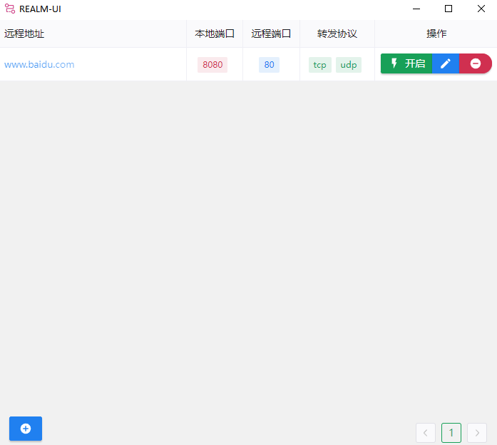
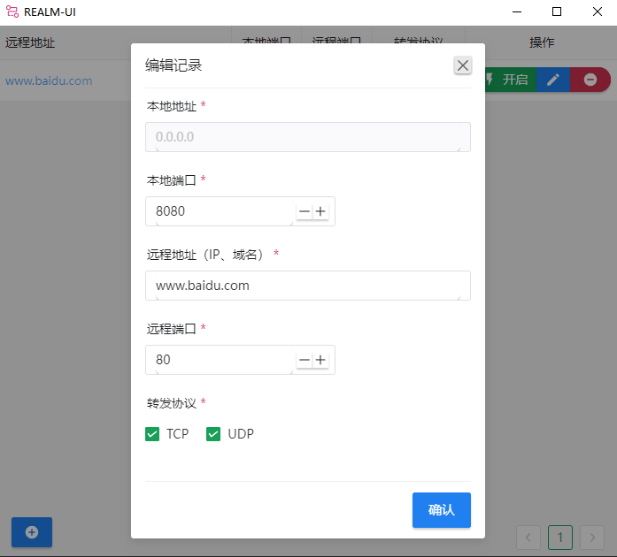

端口转发工具

Tauri开发的，边做边学。

核心功能在这个库：https://github.com/zhboner/realm
这个库没有UI界面，为使用方便做了个UI界面，
只支持Windows。 功能不是很完善，目的是做来自己用的。

> 远程地址支持域名、IPV4、IPV6

不一定会更新，有需要的大佬自己可以去改。

[下载在这里](https://gitee.com/luoyu318/realm-ui/releases)

效果图

